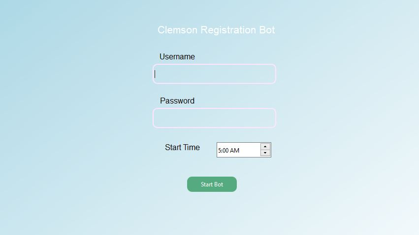

# Description
Automatically adds all planned classes immediately at specified time

## Note!
The registration site on iroar has updated. The add all button has been removed. As of now, this program needs to be updated.

## Requirements
Python </br>
Firefox browser

## Installation
```shell
pip install -r requirements.txt
```

## Usage
```shell
python main.py
```
1. Enter the username and password.
2. Select a time.
At this point, a marionette Firefox browser will pop up.
3. Authenticate 2 Factor Duo manually.
4. Wait until the current time is the selected.
Now the script will immediately execute clicks to submit your pre-planned classes.
# Image

